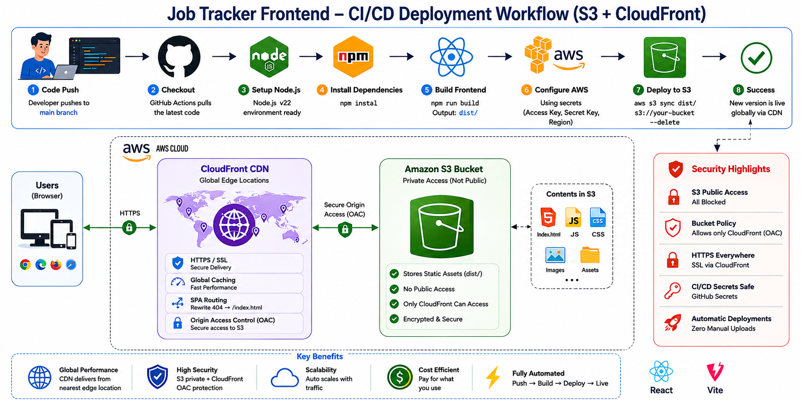

# Job Tracker Frontend — SPA Deployment & CDN Engine

This repository hosts the React Single Page Application (SPA) frontend for the Job Tracker platform which connects to the job-tracker-backend. The application is compiled into static assets via an automated CI/CD pipeline, stored securely inside a private Amazon S3 bucket, and distributed globally over HTTPS via Amazon CloudFront CDN.

---

## 🗺️ System Architecture



---

## ⚙️ Deployment Workflow

### 1. Code Push

- Developer pushes code changes to the `main` branch on GitHub.
- This automatically triggers the GitHub Actions frontend pipeline.

---

### 2. CI/CD Pipeline (GitHub Actions)

On every push to `main`, the pipeline performs:

- **Checkout**
  - Pulls the latest repository code into the runner environment.

- **Setup Node.js Runtime**
  - Configures an isolated Node.js v22 build environment.

- **Install Dependencies**
  - Restores all packages via npm:
    ```bash
    npm install
    ```

- **Build Frontend**
  - Compiles, minifies, and optimizes source code into production-ready static assets inside the `dist/` output directory:
    ```bash
    npm run build
    ```

- **Configure AWS Credentials**
  - Authenticates with AWS using secure GitHub Repository Secrets:
    - `AWS_ACCESS_KEY_ID`
    - `AWS_SECRET_ACCESS_KEY`
    - `AWS_REGION`

- **Deploy to S3**
  - Syncs the compiled `dist/` folder to the S3 bucket. The `--delete` flag removes any files in the bucket that no longer exist in the build output:
    ```bash
    aws s3 sync dist/ s3://${{ secrets.AWS_S3_BUCKET_NAME }} --delete
    ```


---

## ☁️ AWS S3 — Security Hardening

The S3 bucket is fully locked down — no public access of any kind is permitted.

### 🔐 Public Access — Fully Disabled

- All public read permissions, bucket policies, and ACLs are completely blocked.
- Attempting to reach the bucket directly via its S3 endpoint URL returns a `403 Forbidden` error.
- Assets are only retrievable through CloudFront.

### 🛡️ Origin Access Control (OAC)

Because the bucket is private, an Amazon CloudFront Origin Access Control (OAC) policy is used to allow CloudFront to fetch assets securely:

- CloudFront acts as the designated gatekeeper between users and S3.
- A bucket policy is attached to S3 that **explicitly whitelists only your CloudFront Distribution ID**.
- S3 validates cryptographic signatures sent by CloudFront edge nodes on every request.
- No request can bypass the CDN and reach S3 directly.

---

## 🌐 Amazon CloudFront CDN Layer

CloudFront serves as the globally distributed secure gateway for all asset delivery.

| Responsibility | Detail |
|---|---|
| **Global Distribution** | Caches static assets (HTML, JS, CSS) at AWS edge locations worldwide for fast load times |
| **SSL Termination** | Enforces HTTPS on all connections across every edge location |
| **Origin Protection** | Fetches assets from S3 using signed OAC requests — no direct S3 access |

---

## 🔁 CI/CD Pipeline Summary

| Step | Action |
|------|--------|
| 1 | Checkout repository code |
| 2 | Setup Node.js v22 runtime |
| 3 | Install dependencies via `npm install` |
| 4 | Compile and minify build into `dist/` |
| 5 | Authenticate AWS IAM session |
| 6 | Sync `dist/` into private S3 bucket |
| 7 | Remove deleted files via `--delete` flag |

---

## 🔐 Security Design

| Layer | Protection Mechanism |
|---|---|
| **S3 Bucket** | All public access blocked — direct requests return `403 Forbidden` |
| **OAC Policy** | Only the designated CloudFront distribution ID is whitelisted to fetch from S3 |
| **HTTPS Enforcement** | CloudFront enforces HTTPS across all edge locations globally |
| **IAM Credentials** | AWS keys stored as GitHub Secrets — never hardcoded or committed to Git |
| **Asset Cleanup** | `--delete` flag ensures stale files are never served from the bucket |

---
